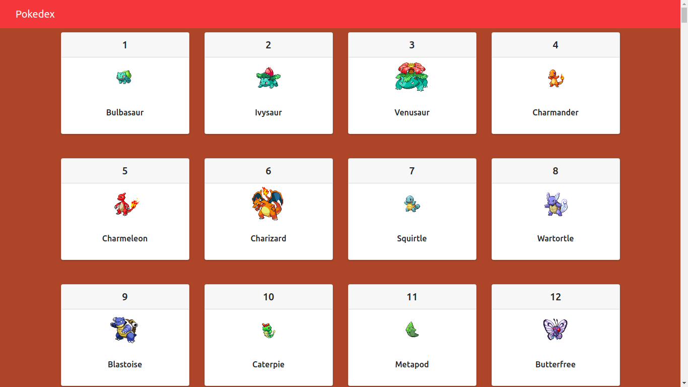

<h1 align="center">
    
</h1>

  
  
  
  
  
  	
  

## 💻 Sobre o projeto

♻️ Pokedex - Um Pokedex básica feita em React para treinar programação

## 🛠 Tecnologias

As seguintes ferramentas foram usadas na construção do projeto:
- [Node.js][nodejs]
- [React][reactjs]

## :memo: License

Esse projeto está sob a licença MIT. Veja o arquivo [LICENSE](LICENSE.md) para mais detalhes.
## Contribua para o projeto 😉

1. Faça um **fork** do projeto.
2. Crie uma nova branch com as suas alterações: `git checkout -b my-feature`
3. Salve as alterações e crie uma mensagem de commit contando o que você fez: `git commit -m "feature: My new feature"`
4. Envie as suas alterações: `git push origin my-feature`
> Caso tenha alguma dúvida confira este [guia de como contribuir no GitHub](https://github.com/firstcontributions/first-contributions)

Antônio Bernardino 👋🏽 [Entre em contato!](https://www.linkedin.com/in/tony-silva/)

[nodejs]: https://nodejs.org/
[reactjs]: https://reactjs.org
[rn]: https://facebook.github.io/react-native/
[yarn]: https://yarnpkg.com/
[vscode]: https://code.visualstudio.com/
[vceditconfig]: https://marketplace.visualstudio.com/items?itemName=EditorConfig.EditorConfig
[license]: https://opensource.org/licenses/MIT
[vceslint]: https://marketplace.visualstudio.com/items?itemName=dbaeumer.vscode-eslint
[prettier]: https://marketplace.visualstudio.com/items?itemName=esbenp.prettier-vscode

